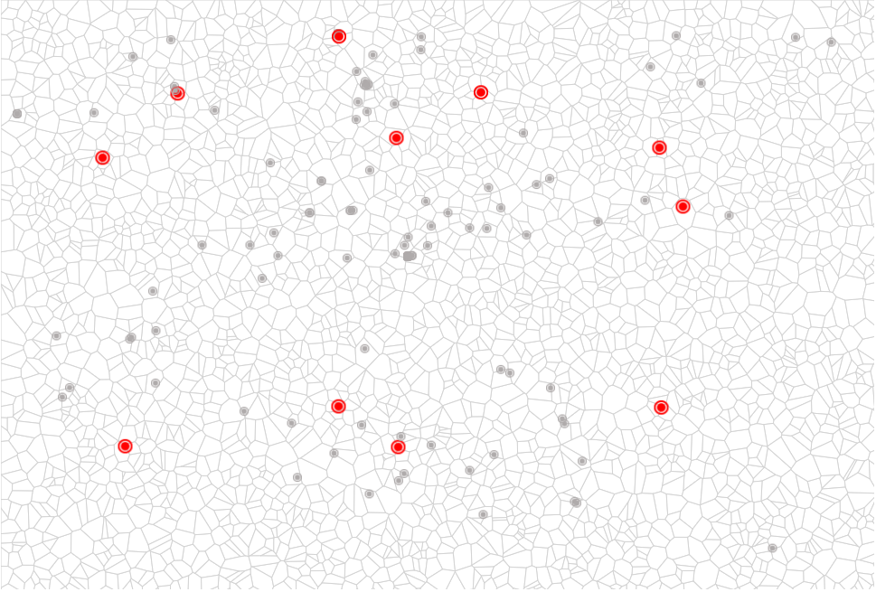

# Visualization Of The Data Relating to Shopping Mall
:convenience_store:a website for visualization of shopping mall data

In this project, we apply the visualization technology to shopping mall consumption analysis.  

**Wiki:http://118.190.210.193/UCAS_17_Fall/index.php/Group_F_Mass_Shooting_in_US_VIS_Project**

**Online Demo：https://visofmall.herokuapp.com/**  

**For the first time you visit the website MallFlow, it will take some time to load the data. You may have to wait for a while.**

## Usege for the demo code  

Execute the following in the terminal.

```
$ git clone https://github.com/jocelynxyq/VISOfMall.git
$ cd VISOfMall
$ npm install
$ node app.js
```
open your browser and visit `localhost:3000`.

Here are some details:

## Visualization User and Task Scenario

### Data

#### Data Source

This project is based on the dataset provided by [CCF Big Data and Computing Intelligent Competition(BDCI) Question 1](http://www.datafountain.cn/#/competitions/279/intro), it provides detailed data for about 100 stores in August 2017, including data such as user targeting and store locations. To protect the privacy of users and merchants, all data is desensitized.  

#### Data Description

There are two tables:

1. Mall-Shop table  

    | Field | Description | 
    | ------------- | ------------- |
    | shop_id | eg:s_26 |
    | longitude | longitude of the shop, eg： 122.346736 |
    | latitude | latitude of the shop, eg： 31.833507  |
    | price | Per capita consumption, eg： 57  |
    | mall_id | eg:m_690 |

2. Shop-Behavior table

    | Field | Description |  
    | ------------- | ------------- |
    | user_id |	id of the consumer, eg:u_395761 |  
    | shop_id |	the shop id where the consumer is |  
    | time_stamp |	consumer behavior timestamp, eg:2017/8/2 20:40:00 |  
    | longitude | longitude of the consumer |  
    | latitude	| latitude of the consumer |  

### User & Task  

* Target User:shopping malls managers
* Tasks
    1. Sales Analysis: compare different time periods, different store sales.
    2. Manpower dispatch: increase manpower input during the peak of consumption, and save manpower cost during the frosty period of consumption.
    3. Ad serving: advertising in places with high customer traffic, or drainage in shops with low traffic.

### Novelty  

* In spatial dimensions, demonstrate intensive and sparse areas of consumer behavior.
* In time dimensions, compare the changes of customer behavior in different time periods.
* In the shop dimension, horizontal comparison of different shops of customer spending.

### Team And Assignment

* 朱倩: Design the overall interface layout, and color of the webpage.
* 徐蕴琪: construction of the project structure, generation of map, realization of histogram.
* 董晨: realization of heatmap, legend, and interaction of data points.
* 魏千程: Data preprocessing, realization of timeline and zoom of the map.

## Data Processing and Analysis  

### Data Processing  

* Mall's data processing

    For the Mall-Shop table's data processing, three steps are listed below:

    1. Extracting each mall‘s data separately;
    2. Calculating total consumption for each mall;
    3. Comparing the data distribution and selecting appropriate mall for Visualization.
* Shop's data processing

    For the Shop-Behavior table's data processing, three steps are listed below:

    1. Extracting each shop‘s data in the same mall;
    2. Sorting and extracting the shop-behavior data by day;
    3. Sorting and extracting the shop-behavior data by hour;

### Analysis  

The data are analyzed from the following aspects：
1. From a global point of view, different shops are compared and analyzed in terms of their price and position in a large shopping mall.
2. From a more detailed point of view, we analyze the consumer behavior of different areas and each shop in the mall.
3. Combining the property of the shop and the consumer behavior, we tested and compared different visualization method.

## Visualization and Interaction Design  

### Visualization Design  

* Map Generate

    1. First of all, we printed all the shop in the space and sorted them by the consumption index, and them we selected the top 15 shops with higher consumption index as center shops. We also generated 30000 random points underneath the shop points for the next print step.  
          
        <div align=center></div>
    2. Secondly, we used clustering algorithm to classify all the shops and printing the area in one color that belong to the same category. In details, the clustering algorithm can be divided in two steps:
        * As there are 138 shop points, we chose them as clustering center, then classified the random points by calculating their distance to the center points, each random point belongs to the category of the nearest shop points. So we classified 30000 points in 138 categories.
        * We used the clustering algorithm for second times to classify the shop points. We set the top 15 shop centers that have been selected before as clustering center, and then calculated the distance between each shop and top 15 shops centers, each shop was classified to the nearest shop center.   
           
    Through the two steps above, we adjusted the classification threshold and got the final map of the mall.  
      

    * Heat map

        1. We used heat map to express the daily consumer behavior. Firstly, we put the daily consumer point of the mall into the same space of the map.  

          

        2. Secondly, we visualized the intensity of consumption behavior with different shades of color.  
        
          

    * Bar graph

        We used bar graph to express fine-grained consumer behavior in different time of a day. There are two different style of bar graph, the first picture below is stacking diagram to express the total consumption of chosen shops in sometime.  

        The other picture is the separate bar graph of different shops that have been chosen by user, you can compare the disparity of consumption of different shops.  

           

           


### Interaction Design  

* Time axis-heatmap
    The map combing mall map and heat map is showing as follow：  
    Heat map reflect the density of consumer behavior in a day, by sliding the button on the timeline under the map, you can view the consumption behavior changes in different regions of the map. This function can let managers monitor the consumer flow changes from a global point of view.
       

* Custom generation of Bar graph
    In order to monitor the consumption behavior in a more accurately way, we use interactive bar graph to show the details for different shops during 12hours in a day. You can choose as many shop points as you want and choose someday in the calendar, then click "generate" button to see the dynamic changes of consumption in the bar graph.   
       

* Zoom & drag of map
    In order to facilitate user's operation, we provide the functions of zoom and drag on the map. When you choose the shop points, you can magnify the map to select them accurately.

       

## Conclusion  

### Function Summary  

As results, we have implemented this program in two aspects:  
* Visualization
    1. Clustering of shop-points in the mall;
    2. Generation of map of the mall;
    3. Marks of center stores;
    4. Generation of consumers' behavior heatmap;
    5. Consumption stacked map;
    6. Consumption histogram.

* Interaction
    1. Drag the map;
    2. Zoom of the map;
    3. Information for a given store;
    4. Drag heatmap timeline;
    5. Switch of heatmap;
    6. Consumption information for given time and a given store.

### User Scenario  

* Sales Analysis: compare different time periods, different store sales.  

* Manpower dispatch: increase manpower input during the peak of consumption(for example, every Friday evening), and save manpower cost during the frosty period of consumption(for example, every Wednesday afternoon).  

* Ad serving: advertising in places with high customer traffic(for example, many people like to wander around shop s_471236 and shop s_63055, so advertising around shop s_471236 and shop s_63055 may be a good idea), or drainage in shops with low traffic.

### Pros & Cons

* Pros:
1. We have completed a complete system with a good overall layout and interface design;
2. We use the clustering algorithm innovatively, gather scattered shop-points into blocks and then form a map which facilitates regional management and decision-making.  

* Cons:
1. The amount of data of one shopping mall may be not enough to support decision-making;
2. So far, we have only visualized dataset of one of the many shopping malls.

## Useful Links
* Online demo：  
    https://visofmall.herokuapp.com/    
